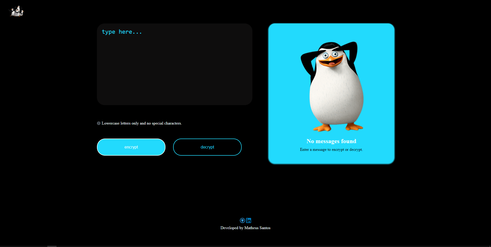

# Challenger Decodificador de Texto - ONE | Alura
Projeto desenvolvido como parte do desafio Challenge do programa Oracle Next Education em colaboração com a Alura. A aplicação tem como objetivo criptografar e descriptografar textos.

<h1>Deco:>er</h1>

* Criptografia por conversão de vogais:

    * Letra "a" é convertida para "ai"
    * Letra "e" é convertida para "enter"
    * Letra "i" é convertida para "imes"
    * Letra "o" é convertida para "ober"
    * Letra "u" é convertida para "ufat"

* Substituir caracteres especiais por espaços em branco

    * Acentos e diacríticos: á, é, í, ó, ú, à, è, ì, ò, ù, â, ê, î, ô, û, ä, ë, ï, ö, ü, ã, ñ, õ, ç
    * Pontuação: !, @, #, $, %, ^, &, *, (, ), _, +, -, =, {, }, [, ], |, \, :, ;, ", ', <, >, ,, ., ?, /
    * Símbolos matemáticos: +, -, =, *, /, %, √, ∞, ≈, ≠, ≤, ≥
    * Símbolos monetários: $, €, £, ¥, ¢, ₹
    * Outros símbolos: ©, ®, ™, §, ¶

* Converter letras maiúsculas em letras minúsculas

    * A conversão é realizada utilizando a propriedade 'text-transform: lowercase' aplicada ao ID text__area - campo no qual o usuário digita o texto.

* Botões

    * <b>Encrypt</b>: Criptografar o texto inserido pelo usuário, após criptografar o texto é transferido para a caixa de saída.

    * <b>Decrypt</b>: Descriptografar o texto inserido pelo usuário, após descriptografar o texto é transferido para a caixa de saída.

    * <b>Copy</b>: Copiar o conteúdo da caixa de saída para a área de transferencia - exibindo um alerta ao usuário - e limpar o campo de entrada.

<h2>💻 Tecnologias</h2>

  

<h2>Funções</h2>

<b>removeSpecialCharacters(text)</b>: Remover todos os caracteres especiais;

<b>encrypt()</b>: Criptografar o texto inserido pelo usuário;

<b>decrypt()</b>: Descriptografar o texto inserido pelo usuário;

<b>copy()</b>: Copiar o resultado da caixa de saída;

<b>clean()</b>: Limpar o texto do campo de entrada;

<b>alertEncrypt()</b>: Mostrar alerta caso o usuário não informe um texto e tente criptografar;

<b>alertDecrypt()</b>: Mostrar alerta caso o usuário não informe um texto e tente descriptografar;

<b>resetContent</b>: Reiniciar o conteúdo da caixa de saída;

<h2>Contatos:</h2> 

* Imagens

Link do programa: